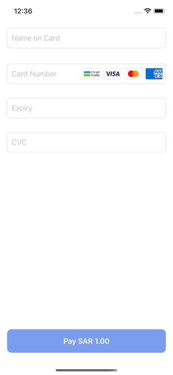

# Moyasar iOS SDK

## Overview

This guide will walk you through a straightforward solution to accept payments within your iOS application. The iOS SDK is a small framework built with **SwiftUI** that allows you to quickly and safely integrate Moyasar payments within your **SwiftUI** or **UIKit** apps.

## Installing CocoaPods

Before you can add the library to your project, you need to install CocoaPods on your macOS using the following command:

```shell
brew install cocoapods
```

Or as a Ruby gem

```shell
gem install cocoapods
```

## Add the Dependency

If you haven't already added CocoaPods to your project, initialize it with:

```shell
pod init
```

Now add the following pod to your `Podfile`:

```ruby
pod 'MoyasarSdk', git: 'https://github.com/moyasar/moyasar-ios-pod.git'
```

:::hint{type="info"}
Make sure to add `use_frameworks!`
:::

### Configurations

Before using the library, make sure to set your API key:

```swift
import MoyasarSdk

try! Moyasar.setApiKey("pk_live_1234567")
```

:::hint{type="info"}
An error will be raised when the key format is incorrect.
:::

### Apple Pay Payments

You can follow [Offering Apple Pay in Your App](https://developer.apple.com/documentation/passkit/apple_pay/offering_apple_pay_in_your_app) to implement Apple Pay within your app.

When the user authorizes the payment using Face ID or Touch ID on their iOS device, the `didAuthorizePayment` event will be dispatched. In this step, you must pass the `token` to `ApplePayService` found within the `PKPayment` object. Here is an example:

```swift
let payment: PKPayment = // Payment object we got in the didAuthorizePayment event

let service = ApplePayService() // From MoyasarSdk
service.authorizePayment(request: request, token: payment.token) {result in
    switch (result) {
    case .success(let payment):
        handleCompletedPaymentResult(payment)
        break
    case .error(let error):
        handlePaymentError(error)
        break
    @unknown default:
        // Handle any future cases
        break
    }
}

func handleCompletedPaymentResult(_ payment: ApiPayment) {
        // ...
    }
    
func handlePaymentError(_ error: Error) {
        // Handle all MoyasarError enum cases
    }

```

:::hint{type="info"}
Don't forget to import `PassKit` and `MoyasarSdk`.
:::

### Credit Card Payments

The SDK provides a SwiftUI view called `CreditCardView` that allows you to easily create a credit card form, here is an example. But first, we need to prepare a `PaymentRequest` object:

```swift
let paymentRequest = PaymentRequest(
    amount: 1000,
    currency: "SAR",
    description: "Flat White",
    metadata: ["order_id": "ios_order_3214124"],
    manual: false,
    saveCard: false
)
```

### SwiftUI Credit Card Payments

We can add the `CreditCardView` to our view as follows:

```swift
struct ContentView: View {
    func handlePaymentResult(_ result: PaymentResult) {
        // ...
    }
    
    func handleCompletedPaymentResult(_ payment: ApiPayment) {
        // ...
    }
    
    func handlePaymentError(_ error: Error) {
        // Handle all MoyasarError enum cases
    }

    var body: some View {
        CreditCardView(request: paymentRequest, callback: handlePaymentResult)
    }
}
```

### UIKit Credit Card Payments

If you are using UIKit you will need to create a wrapper to host the SwiftUI `CreditCardView` view:

```swift
    func makeCreditCardView() {
        let creditCardView = CreditCardView(request: paymentRequest, callback: handlePaymentResult)
        
        let creditCardHostingController = UIHostingController(rootView: creditCardView)
        creditCardHostingController.view.translatesAutoresizingMaskIntoConstraints = false
        
        addChild(creditCardHostingController)
        view.addSubview(creditCardHostingController.view)
        creditCardHostingController.didMove(toParent: self)
        
        NSLayoutConstraint.activate([
            creditCardHostingController.view.topAnchor.constraint(equalTo: view.topAnchor),
            creditCardHostingController.view.leadingAnchor.constraint(equalTo: view.leadingAnchor),
            creditCardHostingController.view.widthAnchor.constraint(equalTo: view.widthAnchor),
            creditCardHostingController.view.heightAnchor.constraint(equalTo: view.heightAnchor)
        ])
    }
    
    
    func handlePaymentResult(_ result: PaymentResult) {
        // ...
    }
    
    func handleCompletedPaymentResult(_ payment: ApiPayment) {
        // ...
    }
    
    func handlePaymentError(_ error: Error) {
        // Handle all MoyasarError enum cases
    }
```

:::hint{type="info"}
Don't forget to import `SwiftUI`.
:::

*  

### Handling Result

Now, we can handle the result as follows:

```swift
func handlePaymentResult(result: PaymentResult) {
    switch (result) {
    case .completed(let payment):
        handleCompletedPaymentResult(payment)
        break
    case .failed(let error):
        handlePaymentError(error)
        break
    case .canceled:
        // Handle cancel Result
        break
    @unknown default:
        // Handle any future cases
         break
    }
}

func handleCompletedPaymentResult(_ payment: ApiPayment) {
        // ...
}
    
func handlePaymentError(_ error: Error) {
        // Handle all MoyasarError enum cases
}
```

:::hint{type="info"}
'Completed' payment doesn't necessarily mean that the payment is successful. It means that the payment process has been completed successfully.
You need to check the payment status as follows to make sure that the payment is successful.
:::

:::hint{type="warning"}
Make sure to handle the screen navigation after getting the result.
:::

The payment status could be `paid` or `failed`, we need to handle this:

```swift
func handleCompletedPaymentResult(_ payment: ApiPayment) {
    switch payment.status {
    case "paid":
        // Handle paid!
        break
    default:
        // Handle other status like failed
    }
}
```

### Objective-C Integration

Setup a Swift file for handling payments as described in:

* [Apple Pay Payments](#apple-pay-payments)
* [Credit Card Payments](#credit-card-payments)
* [UIKit Credit Card Payments](#uikit-credit-card-payments)
* [Handling Result](#handling-result)

After that you can initialize the Swift payments class when processing payments.

Learn more about integrating Swift files in Objective-C apps:
<https://developer.apple.com/documentation/swift/importing-swift-into-objective-c>

### Checkout APIs Documentation

* <https://moyasar.github.io/moyasar-ios-sdk/documentation/moyasarsdk>

### Checkout Demo Examples

* <https://github.com/moyasar/moyasar-ios-sdk>
